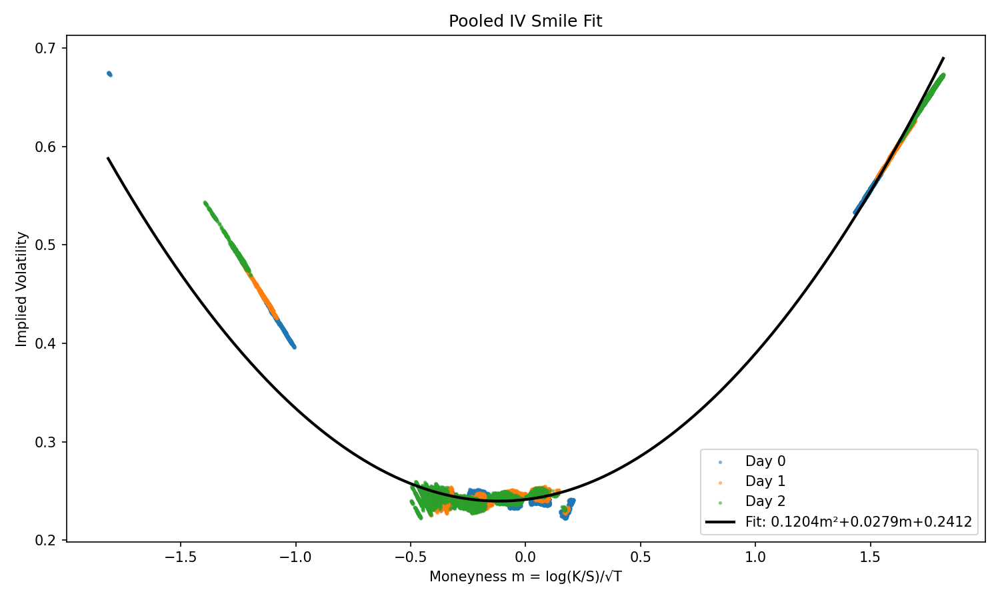

# IMC Prosperity 4 — Team BelmonteHunters

This repository contains our algorithmic-trading work for **IMC Prosperity 4** (April 2026), the global online trading challenge run by IMC.  Only the *algorithmic* side of the competition is documented here — manual-trading submissions are excluded by design.

> **Final result.**  Team **BelmonteHunters** finished round-5 with **X XIRECs** and ranked **X / X** overall (algorithmic).

---

## The challenge

Prosperity 4 runs over 16 days split into **5 rounds** (R1 & R2 last 72 h, R3–R5 last 48 h).  Each round introduces new tradable goods on a closed exchange where every team's algorithm trades **independently** against a fixed set of bots — there is no team-vs-team interaction in the algo channel.  At the end of each round teams lock in their final `Trader` class; that class is run for **10 000 ticks** on a held-out trading day, and the resulting PnL feeds the leaderboard.

Each tick of the simulation follows a fixed timeline:

1. We receive the current `TradingState` with the bots' resting quotes (level-2 order book per product) and the trades that occurred since the previous tick.
2. We decide whether to **take** any of those bot quotes — i.e. cross the spread to buy from a bot ask we judge mispriced, or hit a bot bid we judge mispriced.
3. We post our own resting quotes (limit buy / sell orders) for this tick.
4. The bots react: some of them lift or hit our resting quotes, some trade among themselves, and they post new quotes for the next tick.
5. The next `TradingState` is generated and the loop repeats.

This pipeline is the same for all five rounds.

The **official evaluation** happens on the IMC platform: at each round we receive a few days of historical data (typically three) for the products that round introduces, and when we submit a `Trader` class the platform runs it for one full unseen day (10 000 ticks) against the round's bot population — that final-day PnL is what feeds the leaderboard.  Locally, we developed against a third-party backtester we cloned from <https://github.com/nabayansaha/imc-prosperity-4-backtester>, replaying the released sample days; this is **not** the official simulator, just a faithful enough emulator to iterate quickly between submissions.

For the official rules and the full datamodel see <https://imc-prosperity.notion.site/Prosperity-4>.

---

## Repository layout

```
imc-prosperity4/
├── README.md
├── round_1/
│   ├── Data/      ← raw prices_round_1_day_*.csv  +  trades_round_1_day_*.csv
│   ├── Algo/      ← submitted Trader (single .py) + ablation scripts
│   └── EDA/       ← notebooks / figures used to design the algo
├── round_2/   …  (same layout)
├── round_3/   …
├── round_4/   …
└── round_5/
    ├── Data/
    ├── Algo/
    ├── EDA/
    └── autoresearch/   ← multi-phase research pipeline used only for R5
```

Each round folder is self-contained: open it, read the `Algo/` source, the `EDA/` notebooks, and you have the full provenance of that round's submission.

---

## Round 1 — ASH_COATED_OSMIUM & INTARIAN_PEPPER_ROOT

> Final PnL: **X XIRECs** · rank **X / X**

📁 [`round_1/`](round_1/) — submitted file: [`round_1/Algo/algo_r1.py`](round_1/Algo/algo_r1.py)

Round 1 introduced two products with position limit 80: **ASH_COATED_OSMIUM** (mean-reverting around ~10 000) and **INTARIAN_PEPPER_ROOT** (drifting upward almost deterministically).  Our EDA notebook is at [`round_1/EDA/data_exploration.ipynb`](round_1/EDA/data_exploration.ipynb).

#### High-level strategy

The skeleton is the same for both products and is the template we reuse in every following round:

1. **Compute a fair price** for the product on each tick.
2. **Take any bot quote that is mispriced relative to fair** — buy from any bot ask `≤ fair`, sell into any bot bid `≥ fair`.
3. **Market-make around the best remaining bid / ask** (post a passive bid one tick inside the bid, and a passive ask one tick inside the ask), with the constraint that **our resting quotes never cross our own fair**.

Everything else — premium thresholds, inventory skew, opportunistic wide quotes — are layered modifications of those three steps.

#### Reverse-engineering the fair price

Both products behave as if there is a *true* fair price hidden inside the order book — bots quote noisily around it but cross it as soon as you do.  To recover that fair price empirically we used a small trick: **submit an algorithm that simply holds a fixed position of +1 in the asset, and read the per-tick PnL series that the platform writes to the submission log**.  Since PnL = position · Δfair, those logs give us a near-perfect tick-by-tick reconstruction of the hidden fair, which we could then fit offline.

- **ASH** — the recovered fair price is well approximated by an EMA of the **microprice**, `mp = (bb·av + ba·bv) / (bv + av)`, with smoothing factor `α = 0.215`.  See [`algo_r1.py:23-41`](round_1/Algo/algo_r1.py#L23-L41).
- **INT** — the recovered fair price is essentially **linear in time**.  We fitted the closed-form expression
  ```
  fair(t) = base + round((t/100) · 102.4) / 1024
  ```
  where `base` is snapped to the nearest 1 000 from the current quotes.  This formula reproduces the published PnL series almost exactly.  See [`algo_r1.py:107-114`](round_1/Algo/algo_r1.py#L107-L114).

#### Per-product position bias

The two products have very different price dynamics, so the bias we bake into the quoting differs:

- **INT — premium logic to stay as long as possible.**  Because INT drifts upward almost monotonically, just being long is a positive-expectancy strategy.  We exploit that with **asymmetric premium thresholds** (INT only): we buy as long as the bot ask is `≤ fair + 8`, but only sell when the bot bid is `≥ fair + 12`.  In other words we are willing to buy *above* our estimate of fair, and we refuse to sell unless we get a real markup.  This pushes the position long without us having to predict direction.  As a side effect the premiums also act as a regime-change buffer: while the formula is still warming up at the start of the day, or during sudden moves, the algo simply abstains rather than trading on a stale fair.
- **ASH — inventory skew to stay close to neutral.**  ASH mean-reverts and the source of edge is symmetric two-sided quoting, so the goal is to **avoid accumulating directional inventory**.  We subtract `INV_SKEW · position` (with `INV_SKEW = 0.10`) from the fair value before each take/quote step, which biases the algo to sell when long and buy when short, pulling the position back toward zero.

#### Wide-quote opportunism on missing-side ticks

Inspecting the level-2 books we noticed that on a small fraction of ticks for **INT**, one side of the book disappears entirely (no bid OR no ask present).  When that happens, an aggressive bot will sometimes lift / hit a quote we leave **up to ~95 ticks away from fair**, which is an enormous mark-to-market profit on a single fill.  The current submission therefore plants a quote at `fair − 95` (or `fair + 95`) on missing-side ticks via the `if bb is None …` / `if ba is None …` branches in `ash_makes` and `int_makes`.

We also tested the inverse idea: **proactively *taking* the bots' near-fair quotes ourselves to remove one side of the book**, so that we could then post our own wide quote far from fair and hope an aggressive bot would lift it.  Concretely, sweep the bid side clean and post a new bid at `fair − 95`; if a bot fills it we collect ~95 ticks of edge.  But the cost of clearing the book in the first place — paying `(fair − bid_price) · volume` to take all the resting bids — was always larger than the upside of the speculative wide-fill.  In short: wide-edge fills only pay when the book is *organically* one-sided; manufacturing the condition is a losing trade.  We kept only the passive "quote far when nothing else is there" version.

---

## Round 2 — same products, blind-auction for extra market access

> Final PnL: **X XIRECs** · rank **X / X**

📁 [`round_2/`](round_2/) — submitted file: [`round_2/Algo/algo_r2.py`](round_2/Algo/algo_r2.py)

Round 2 keeps the same two products (`ASH_COATED_OSMIUM`, `INTARIAN_PEPPER_ROOT`, position limit 80 each) but introduces a one-off twist: a **Market Access Fee** auction.  Each team can include a `bid()` method in their `Trader` class returning a one-time fee in XIRECs; the **top 50 % of bids** (i.e. those above the cross-team median) win a **25 % larger order book** for the round — the extra quotes slot perfectly into the existing depth distribution.  The accepted bid is then deducted from R2 PnL; teams in the bottom half pay nothing and trade the unmodified book.  Because bids are revealed only after submissions close, it is effectively a blind auction.

Rounds 1 and 2 jointly serve as a qualifier: a team needs **≥ 200 000 XIRECs** of cumulative algorithmic PnL across the two rounds to advance to rounds 3-5, and the leaderboard is reset for Phase 2 regardless of the surplus we accumulate beyond it.  We had already cleared the threshold in Round 1, so two things were true at submission time: (1) marginal PnL beyond the qualifier had no impact on Phase 2, and (2) any MAF bid we won would directly reduce the comfort cushion we still wanted as a safety margin.  We therefore chose **not to spend further effort on Round 2** — we resubmitted the Round 1 algorithm verbatim, with `bid()` returning **0** (effectively opting out of the auction and trading the unmodified 80 % book).

The submitted file [`algo_r2.py`](round_2/Algo/algo_r2.py) is identical to [`algo_r1.py`](round_1/Algo/algo_r1.py) except for the added `bid()` method.

---

## Round 3 — Hydrogel, Velvetfruit, and 10 Velvetfruit-Extract Vouchers

> Final PnL: **X XIRECs** · rank **X / X**

📁 [`round_3/`](round_3/) — submitted file: [`round_3/Algo/algo_r3.py`](round_3/Algo/algo_r3.py)

Round 3 launches Phase 2: leaderboard reset, all teams start from zero PnL, and the planet of Solvenar introduces three new products.  Two are familiar **delta-1** assets: `HYDROGEL_PACK` and `VELVETFRUIT_EXTRACT` (position limit 200 each).  The third is a strip of **10 European-style call vouchers** on VELV, with strikes in `{4000, 4500, 5000, 5100, 5200, 5300, 5400, 5500, 6000, 6500}`, position limit 300 each, and a 7-day expiry that started at R1 — so **TTE = 5 days at the start of the R3 evaluation day**.  EDA notebooks at [`round_3/EDA/`](round_3/EDA/).

#### IV scalping: the strategy IMC pointed us at, that we never made work

The IMC moderators and on-board advisors strongly suggested the canonical option-market-maker play: **implied-volatility scalping**.  Sketching it for someone who has not seen it before:

1. From the mid prices of each voucher and of the underlying VEV, invert Black-Scholes to obtain an **implied volatility** σᵢ for every voucher i.
2. Plot σᵢ against the voucher's **moneyness** `m = log(K / S) / √T`.  Empirically this cloud forms a **smile** (or **skew**): vouchers far away from the at-the-money strike trade at higher IV than the ones near it.  The plot below is our pooled IV-smile across the 3 R3 sample days, fit with a quadratic — see [`round_3/Algo/smile_fit/`](round_3/Algo/smile_fit/).
   
   
   
   `σ̂(m) = 0.1204·m² + 0.0279·m + 0.2412` — fairly tame around ATM, much wider in the deep-OTM wings.
3. Re-price each voucher with `σ̂(m)` to get a **theoretical fair price**.  If the voucher trades above `σ̂` we sell it; if below, we buy.  The bet is that the 10 vouchers revert to the fitted smile, *not* that VEV moves — so we **delta-hedge** the option position with VEV so pure σ-mean-reversion is the only exposure left.

We explored this exhaustively — the research version is in [`round_3/Algo/algo_r3_iv.py`](round_3/Algo/algo_r3_iv.py).  We swept the z-score threshold on (σᵢ − σ̂(m)), the EMA half-life of the residual, the position-sizing curve, the delta-hedge granularity (fully hedged each tick vs. partial hedge on aggregate book Δ), and several smile parameterisations (per-day vs. pooled, with / without `VEV_5300`, log-strike vs. absolute moneyness).  We also tried orthogonal ideas: pure z-score mean-reversion on the IV residual without hedging, and cross-strike pair trading.  **None of these produced reliable PnL** — backtests hovered near zero with large drawdowns, and configurations that looked good in-sample did not survive the held-out submission day.  The main suspects: the smile drifts day to day in the wings (see [`iv_smile_per_day.png`](round_3/Algo/smile_fit/plots/iv_smile_per_day.png)); the IV residuals are not mean-reverting on a tradeable horizon; and at TTE = 5d the gamma exposure dominates the 1-tick edges we tried to capture.

#### What we shipped

After convincing ourselves that IV scalping was not going to deliver, we shipped [`algo_r3.py`](round_3/Algo/algo_r3.py).  The strategy is deliberately simple:

- **HYDR & VELV** — same template as Round 1: compute fair → take mispriced bot quotes → market-make inside the spread without crossing fair.  HYDR runs an explicit 3-step pipeline (`profit_takes → inventory_rebalance → penny_make`) where the rebalance step uses an inventory-skewed fair, identical in spirit to R1's ASH.
- **Vouchers** — only the near-the-money strikes (`VEV_5000`, `_5100`, `_5200`, `_5400`, `_5500`) are quoted with a thin BS-around-smile theoretical price; `VEV_5300` is excluded because the fitted smile under-prices it on our data, and the deep-OTM wings (`4000` / `4500` / `6000` / `6500`) are not traded at all.

The point of the shipped algo was to **harvest the safe delta-1 PnL on HYDR / VELV** and not bleed on options.

---

## Round 4 — same products, counterparty IDs disclosed ("Hello, I'm Mark")

> Final PnL: **X XIRECs** · rank **X / X**

📁 [`round_4/`](round_4/) — submitted file: [`round_4/Algo/algo_r4.py`](round_4/Algo/algo_r4.py)

Round 4 keeps the R3 universe (`HYDROGEL_PACK`, `VELVETFRUIT_EXTRACT`, 10 `VEV_*` vouchers; same position limits 200 / 200 / 300; TTE = 4 days at the start of the evaluation day) but the **Trade Watch** now publishes counterparty IDs: every `Trade` arriving in `state.market_trades` carries the names of the bots on each side (`buyer`, `seller`), instead of `None`.  The bots are seven characters labelled `Mark 01`, `Mark 14`, `Mark 22`, `Mark 38`, `Mark 49`, `Mark 55`, `Mark 67`.

#### What we shipped — simple per-product fixed-fair mean reversion

Once we let go of the option-pricing framing from R3 and looked at the data flat, every product turned out to be a clean **fixed-fair mean reversion** problem.  We computed a stable per-product fair value from the historical 4 days of data, and then *take* any quote that is at least `buy_t` below or `sell_t` above it.  We tuned the fair value and thresholds with a clean per-day cross-validation across the 4 days of historical data — train on three days, test on the fourth, rotate — and kept only configurations that did not over-fit any single day.  The full calibrated configuration is the `CONFIG` dict at the top of [`algo_r4.py`](round_4/Algo/algo_r4.py).  Five fair-value methods are needed:

- **A — static fair**: a constant fair price (`VELV`, `VEV_4000`, `VEV_4500`, `VEV_5000`, `VEV_5100`).
- **C — linear time trend**: `fair(t) = slope · (TRAIN_OFFSET + t) + intercept`, used on `HYDROGEL_PACK` which drifts.
- **D — EMA on mid**: `fair ← fair + α · (mid − fair)` with α ∈ [3 × 10⁻⁴, 10⁻³], used on the noisier deep-OTM vouchers (`VEV_5300`, `_5400`, `_5500`).
- **F — static with asymmetric thresholds**: same as A but `buy_t ≠ sell_t` (`VEV_5200`).
- **Z — quote dust**: post a bid at price 0 and a tiny ask at price 1 (`VEV_6000`, `VEV_6500` are too quiet to mean-revert; the dust quotes catch rounding-error fills for free).

`HYDROGEL_PACK`, `VELVETFRUIT_EXTRACT` and `VEV_4000` get an additional **passive MM layer** on top of the take logic — bid one tick above and ask one tick below the inside, sized at 10 lots, gated off when `|position| ≥ 100` or the spread is below 3 ticks.

This calibrated MR per product backtests **consistently above 200 k** XIRECs across the 4 days of historical data — an order of magnitude more than the IV-scalping route from R3 (~20 k), without ever using the smile.

#### Counterparty research — the seven Marks

We did spend a serious amount of time profiling the seven bots from the disclosed `buyer` / `seller` fields.  The 3-day fingerprint is extremely stable across days:

| Mark | 3d PnL  | Profile                    | Active products                                 |
|-----:|--------:|----------------------------|-------------------------------------------------|
|  14  | +42 206 | Dedicated MM (both sides)  | HYDROGEL, VEV_4000, VELV, ATM vouchers          |
|  67  | +27 261 | **Informed buy-only**      | VELV                                            |
|  01  | +10 100 | Passive bidder (buy-heavy) | VELV, OTM vouchers (5300–6500)                  |
|  55  | −13 204 | Active 2-way taker         | VELV                                            |
|  49  | −15 346 | Uninformed sell-only       | VELV                                            |
|  22  | −17 395 | Passive seller             | VELV, OTM vouchers (5300–6500)                  |
|  38  | −33 622 | **Aggressive uninformed taker** | HYDROGEL, VEV_4000                         |

Three pairings explain almost all the volume:

- **HYDROGEL & VEV_4000 ⇒ Mark 14 ↔ Mark 38** (98.2 % and 99.3 % of volume respectively).  Mark 14 quotes a static ±8 (HYDR) / ±10 (VEV_4000) book, Mark 38 lifts/hits aggressively but is *negatively* informed at all horizons ≤ 10 k ticks — Mark 14 collects spread *and* favourable adverse selection.
- **OTM vouchers ⇒ Mark 22 → Mark 01** (100 % of `VEV_6000` / `VEV_6500` flow).  Mark 22 sells +0.5 above mid, Mark 01 buys −0.5 below; the mid drifts up so Mark 22 leaks PnL.
- **VELV** is more complex: Mark 67 is buy-only and **informed** (mid rises +1.9 by +5 k ticks after a Mark 67 print); Mark 49 is sell-only and **uninformed** (mid rises +1.7-2.6 after a Mark 49 print) → both are clean follow / fade signals.

The concrete alphas this suggested were: (A) quote inside Mark 14 by 1 tick on HYDROGEL / VEV_4000 to cut queue when Mark 38 sweeps; (B) lift VELV on every Mark 67 buy print and on every Mark 49 sell print; (C) post bids inside Mark 01 on the OTM vouchers; (D) use Mark 14's net VELV flow as a slow trend filter (corr ≈ +0.19 with the next 50 k mid move); (E) skip 4500 / 5000 / 5100 / 5200 entirely (rounding-error volume).

#### Why none of this shipped

We implemented every one of those Mark-aware tweaks on top of `algo_r4.py` — and **none of them moved the needle on the backtester PnL**, individually or stacked.  The shipped algo already takes the same fills the Mark logic would suggest, just without naming the counterparty: when Mark 38 sweeps Mark 14, our quote is already at the touch and we have already bought / sold; when Mark 67 prints, the VELV mid has already moved enough that our static-fair MR has triggered.  The Mark identities are *real* signals, but they're already absorbed by the simple fair-value framework on the 4 days of data we had to test against.  Rather than ship a more complex algorithm whose extra parameters could overfit, we shipped the simple one and left the counterparty data out.

---

## Round 5 — 50 new products, 10 categories, "Cherry Picking Winners"

> Final PnL: **X XIRECs** · rank **X / X**

📁 [`round_5/`](round_5/) — submitted file: [`round_5/Algo/algo_r5.py`](round_5/Algo/algo_r5.py)

The final round wipes the slate: all previous-round products are removed, and **50 new ones** appear, evenly distributed across 10 categories of 5 (`PEBBLES`, `SNACKPACK`, `MICROCHIP`, `SLEEP_POD`, `ROBOT`, `GALAXY_SOUNDS`, `OXYGEN_SHAKE`, `PANEL`, `TRANSLATOR`, `UV_VISOR`).  The position limit is now a uniform **10 per product**.  We have three days of historical data and the submitted algorithm runs on a fourth, unseen day.

The full list of products is in [`round_5/Algo/algo_r5.py:9-31`](round_5/Algo/algo_r5.py#L9-L31).

#### Strategy framing

With 50 products and a tiny position limit, single-asset MM edges are too thin to pay; the productive question becomes *what cross-product structure exists between these 50 names*?  We hypothesised — and ultimately confirmed — that the round is built around **pair trading and basket invariants**, with the 10 categories of 5 designed as containers for both within-group and cross-group relationships.

#### autoresearch — Claude-Code research pipeline

To explore the universe systematically rather than ad-hoc, we built a multi-phase research scaffold inspired by <https://github.com/karpathy/autoresearch>, driven by [Claude Code](https://www.anthropic.com/claude-code).  Numbered phases `00–12` are *experiments*; phases `13–16` are *deliverables* (findings, final strategy, parameter tuning, post-audit).  Every decision is backed by an artefact in the corresponding folder.  The full pipeline lives at [`round_5/autoresearch/`](round_5/autoresearch/) — see its [README](round_5/autoresearch/README.md) for the full audit trail.

#### Ideas tested — kept

- **`PEBBLES` Σ = 50 000 deterministic invariant** — `Σ_i mid_i ∈ [49 981, 50 016]`, std 2.8, OU half-life 0.16 ticks, R² 0.999998. Each pebble's quote tilted by `−resid/divisor`.
- **`SNACKPACK` Σ ≈ 50 221 looser invariant** — std 190, used as a smaller skew with the same mechanism.
- **9 within-group cointegrating pairs** — walk-forward OOS Sharpe ≥ 1 (e.g. `MICROCHIP_RECTANGLE/SQUARE` ADF p=0.004, `SNACKPACK_RASPBERRY/VANILLA` ADF p=0.001).
- **Cross-group cointegrating pairs** — Phase-11 lagged-EG sweep over 1 200 (pair × lag) combos, **expanded from 30 → 157 pairs** in Phase-15 (PnL monotonic in pair count, no capacity collision).
- **Lattice / AR(1) products** — `OXYGEN_SHAKE_EVENING_BREATH` 453 distinct mids, `ROBOT_IRONING` 631; standard inside-spread MM with global inv-skew.
- **`ROBOT_DISHES` dedicated handler** — Phase-16: removed from the global pair-skew dict, replaced by tilts from 4 novel log-pair residuals + tighter `inv_skew_β = 0.6`. +20 803 PnL on this product alone.
- **`PROD_CAP` for 10 historical bleeders** — Phase-10 bleeder forensics: `spread/vol < 0.6` products were getting adversely selected; capping to ±3..5 recovered +134 K in v2 ablation.
- **Per-product `inv_skew_β` overrides** — `MICROCHIP_OVAL = 0.40`, `SLEEP_POD_POLYESTER = 0.40`, `ROBOT_DISHES = 0.60` (the rest stay at 0.20).
- **Inside-spread market-making at `bb+1 / ba−1`** — the workhorse spread-capture floor every other signal sits on top of.

#### Ideas tested — dropped

- **Sine fits on 7 high-R² products** (R² ≥ 0.96 on `MICROCHIP_OVAL`, `UV_VISOR_AMBER`, `OXYGEN_SHAKE_GARLIC`, `SLEEP_POD_POLYESTER/SUEDE`, `PEBBLES_XS/XL`) — fitted period equals the training-window length, only `UV_VISOR_AMBER` improves on flat-mean OOS, ablation of that single overlay was −496 PnL.
- **`OXYGEN_SHAKE_CHOCOLATE / OXYGEN_SHAKE_GARLIC` cointegration** — claimed ADF p=0.030, reverified p=**0.92** on the full stitched series.
- **Higher-rank Johansen cointegration** — only `PEBBLES` has rank 1 (already used); `SNACKPACK` rank 5 but residual std 0.96 → tiny capacity. No other group has rank > 0.
- **Multi-level OFI** — max IC = 0.10, negative on lattice products. Folded into `PROD_CAP` instead.
- **Lagged OFI / cross-flow OFI(i) → ret(j)** — strongest is just AR(1) restated (max |IC| = 0.090); cross-product max |IC| = 0.017.
- **Extended AR / lag-IC at p > 1** — max |IC| = 0.038 (`ROBOT_IRONING@k=96`); insufficient after spread.
- **VAR / Granger within-group** — 4 trivial leaders, no positive Sharpe.
- **Intraday seasonality (100-bin mod-day)** — max cross-day correlation 0.13, below 0.30 inclusion threshold.
- **Lead-lag pairs** — only `PANEL_1X4 → PANEL_1X2` at lag 33 survives, ~2 K/day, dominated by within-group cointegration on the same pair.
- **`SNACKPACK` min-var weighted basket** — tighter rel-std but ablation −68 PnL vs equal-weight.
- **Cross-group min-var triplets** — 157 stationary triplets exist but residual std too large vs spread cost.
- **AR(1) maker-skew overlay** — skew magnitude `|φ · Δmid · α| ≈ 0.24` falls below the maker's `fair > bid − 0.25` order-gate, fires zero orders.
- **Tier-1 universal hyperparameter sweep** (50 LHS + 40 TPE) — best candidate beat baseline mean by +8 K but lost on median by 0.2 % → killed by the strict 5-gate. Reverted to baseline.
- **Sharpe-maximising configs** — found one (β=0.335, Sharpe 73.7 vs baseline 63) but mean −531 / median −5 366. Sharpe alone is misleading when total PnL is the goal.
- **AR(1) skew on priority products** (`OXYGEN_SHAKE_EVENING_BREATH`, `ROBOT_IRONING`, `OXYGEN_SHAKE_CHOCOLATE`) — tested as additive skew, all 4 priority products either inert or actively harmful.

20+ distinct ideas examined; the full audit (with rejection reasons) is in [`autoresearch/README.md`](round_5/autoresearch/README.md) and the dedicated `what_was_dropped.md` files inside `15_parameter_tuning/` and `16_post_audit/`.

#### Anti-overfitting

Every signal that made it into the algo had to clear three independent filters before being shipped:

1. **Walk-forward OOS Sharpe ≥ 1** on a rotating fold structure (train 2 days, test on the 3rd, rotate).
2. **ADF re-verification on the full stitched window**, with hand-checked stats — this is what dropped the originally-claimed `OXYGEN_SHAKE_CHOCOLATE/GARLIC` pair (ADF p = 0.92 on full data, far from the originally-quoted 0.03).
3. **Per-component ablation in the live algorithm**: every basket / pair / cap was added one at a time, each variant backtested against the prior one; we kept the addition only if it improved 3-day cumulative PnL by more than the run-to-run engine variance (~20 K).

Beyond the automated filters, every conclusion was **hand-verified** end-to-end by reading the raw CSVs and reproducing the headline statistics from scratch.

#### What we shipped

[`algo_r5.py`](round_5/Algo/algo_r5.py) is one Trader class with a single `take + clean + make` template applied to all 50 products, with the per-product fair value computed as

```
fair_i = mid_i  +  basket_skew_i  +  pair_skew_i  +  inventory_skew_i
```

where:

- `basket_skew_i` enforces the PEBBLES Σ = 50 000 and SNACKPACK Σ = 50 221 invariants;
- `pair_skew_i` aggregates tilts from the 9 within-group + 30 cross-group cointegrating pairs in `ALL_PAIRS`;
- `inventory_skew_i = -β · position` (β = 0.20 globally; 0.40 for `MICROCHIP_OVAL` and `SLEEP_POD_POLYESTER`; 0.60 for `ROBOT_DISHES`);
- `ROBOT_DISHES` additionally receives a **dedicated log-pair tilt** combining 4 novel log-space residuals.

`PROD_CAP` clamps the position below ±10 on the 10 historical bleeders.  When the basket residual exceeds `BIG_SKEW`, the algo also crosses the spread aggressively (size 2) to fade the deviation; otherwise it sits passively one tick inside the inside.

3-day backtest on R5 days 2/3/4: **1,420,758 PnL · Sharpe 22.81 · max DD 25,532 · Calmar 55.6** (sanity-checked locally).

---

## License

Code in this repository is published under the MIT license.  IMC Prosperity is the property of IMC Trading; this repo is an unofficial student archive of our team's work on the 2026 edition.
